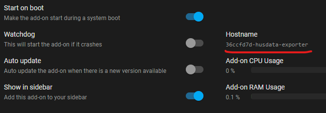

# Husdata Prometheus Exporter for Home Assistant

## Overview
Husdata Prometheus Exporter is a Home Assistant add-on that integrates with Husdata gateways(H60/H66). It polls and exports data from these Husdata gateways, presenting Husdata heat pump metrics in a format that is fully compatible with Prometheus, enhancing your ability to monitor and analyze your heat pump's performance effectively.

This add-on has been developed primarily for the Husdata H66 and Nibe ground source heat pumps equipped with the Styr2002 interface as well as the Bosch EHP AW pumps with the Rego800 interface. It offers mostly complete metrics coverage for these specific models, as supported by Husdata. While a lot of the metrics should work for other heat pumps as well the compatibility and functionality may vary.

## Features
- Periodic polling of data from Husdata gateways.
- Exports Husdata metrics in a prometheus format for easy integration and monitoring.
- Customizable polling intervals.
- Supports Swedish and English label values for sensors etc(see below).
- Supports Home Assistant Ingress and a toggleable external server for direct access.

## Installation

### Prerequisites
- A running Home Assistant installation with add-on support
- Heatpump with a Husdata H60 or H66 gateway connected and API enabled

### Steps
1. **Add Repository to Home Assistant:**
    

    Or manually:
   - Navigate to the Add-on Store in your Home Assistant UI: `Settings` -> `Add-ons` -> `Add-on Store`.
   - Click the 3-dots in the upper right corner, select `Repositories`, and paste in this URL: [https://github.com/prankstr/hassio-husdata-exporter](https://github.com/prankstr/hassio-husdata-exporter)

2. **Install Husdata Exporter:**
   - Refresh the page
   - Find Husdata Exporter in the list of available add-ons, open it and click 'Install'.

## Configuration
Configure the add-on through the Home Assistant UI with the following options:
- `husdata_hostname` (required): Hostname or IP address of your Husdata gateway.
- `language` (optional): Language for metrics (options: "Swedish", "English"; default: "Swedish").
- `external_server` (optional): Enable/disable direct access to the add-on (default: false).
- `poll_interval` (optional): Time interval (in seconds) between data polls (default: 15).
- `log_level` (optional): Set the logging level (options: "Info", "Debug", "Warn", "Error"; default: "Info").

## Usage
Once the Husdata Exporter add-on is configured and running:
- The exporter will start polling data from your Husdata gateway immediately.
- For scraping within Home Assistant: Configure your monitoring tool to scrape metrics from `http://d5f5b367-husdata-exporter:8099/metrics`.
- For external scraping: Enable the external server in settings and configure your tool to scrape from `http://<your-server-ip-or-hostname>:9101/metrics`.

If the internal hostname isn't working - verify that it's correct by navigating to the add-on page and check the hostname. `Settings` -> `Add-ons` -> `Husdata Exporter`. Use the value underlined in red.

## Available Metrics

| Register  | Metric Name                                             | Description                                               | Label (English)          | Label (Swedish)          |
|-----------|---------------------------------------------------------|---------------------------------------------------------  |--------------------------|--------------------------|
| `0001`    | `heatpump_sensor_temperature_celsius`                   | Radiator return temperature                               | Radiator return          | Returledning             |
| `0003`    | `heatpump_sensor_temperature_celsius`                   | Internal heat carrier return temperature                  | Heat carrier return      | Returledning intern      |
| `0004`    | `heatpump_sensor_temperature_celsius`                   | Internal heat carrier forward temperature                 | Heat carrier forward     | Framledning              |
| `0005`    | `heatpump_sensor_temperature_celsius`                   | Brine In / Condensor                                      | Brine in / Condensor     | Köldbärare In            |
| `0006`    | `heatpump_sensor_temperature_celsius`                   | Brine Out / Evaporator                                    | Brine out / Evaporator   | Köldbärare Ut            |
| `0007`    | `heatpump_sensor_temperature_celsius`                   | Oudoor temperature                                        | Outdoor                  | Ute                      |
| `0008`    | `heatpump_sensor_temperature_celsius`                   | Indoor temperature                                        | Indoor                   | Rum                      |
| `0009`    | `heatpump_sensor_temperature_celsius`                   | Hot water top temperature                                 | Hot water top            | Varmvatten Topp          |
| `000A`    | `heatpump_sensor_temperature_celsius`                   | Hot water bottom/mid temperature                          | Hot water mid            | Varmvatten Laddning      |
| `000B`    | `heatpump_sensor_temperature_celsius`                   | Hot Gas temperature                                       | Hot Gas                  | Hetgas                   |
| `000C`    | `heatpump_sensor_temperature_celsius`                   | Suction gas temperature                                   | Suction Gas              | Suggas                   |
| `000D`    | `heatpump_sensor_temperature_celsius`                   | Liquid flow temperature                                   | Liquid Flow              | Vätskeledning            |
| `000E`    | `heatpump_sensor_temperature_celsius`                   | Air Intake temperature                                    | Air Intake               | Luftintag                |
| `0011`    | `heatpump_sensor_temperature_celsius`                   | Pool forward temperature                                  | Pool                     | Pool                     |
| `0020`    | `heatpump_sensor_temperature_celsius`                   | Internal heat carrier forward temperature for circuit 2   | Radiator forward 2       | Framledning 2            |
| `0022`    | `heatpump_sensor_temperature_celsius`                   | Radiator return temperature for circuit 2                 | Radiator return 2        | Returledning 2           |
| `4101`    | `heatpump_sensor_current_ampere`                        | Current draw L1                                           | L1                       | L1                       |
| `4102`    | `heatpump_sensor_current_ampere`                        | Current draw L2                                           | L2                       | L2                       |
| `4103`    | `heatpump_sensor_current_ampere`                        | Current draw L3                                           | L3                       | L3                       |
| `BC61`    | `heatpump_unit_starts_total`                            | Total amount of compressor starts                         | Compressor               | Kompressor               |
| `6C60`    | `heatpump_unit_runtime_seconds_total`                   | Total compressor runtime in seconds                       | Compressor               | Kompressor               |
| `6C63`    | `heatpump_unit_runtime_seconds_total`                   | Total amount of added heat in seconds                     | Add heat                 | Tillskott                |
| `6C64`    | `heatpump_unit_runtime_seconds_total`                   | Total amount of hot water preparation in seconds          | Hot water                | Varmvattenladdning       |
| `1A01`    | `heatpump_unit_on`                                      | Compressor on/of                                          | Compressor               | Kompressor               |
| `1A02`    | `heatpump_unit_on`                                      | Add heat step 1 on/off                                    | Add Heat step 1          | Tillskott Steg I         |
| `1A03`    | `heatpump_unit_on`                                      | Add heat step 2 on/off                                    | Add Heat step 2          | Tillskott Steg II        |
| `1A04`    | `heatpump_unit_on`                                      | Pump Heat Circuit on/off                                  | Pump heat circuit        | Värmebärarpump           |
| `1A05`    | `heatpump_unit_on`                                      | Pump Cold Circuit on/off                                  | Pump cold circuit        | Köldbärarpump            |
| `1A06`    | `heatpump_unit_on`                                      | Radiator pump on/off                                      | Pump radiator            | Cirkulationspump         |
| `1A07`    | `heatpump_unit_on`                                      | Switch Valve 1 on/off                                     | Switch valve 1           | Växelventil 1            |
| `1A08`    | `heatpump_unit_on`                                      | Switch Valve 2 on/off                                     | Switch valve 2           | Växelventil 2            |
| `1A0C`    | `heatpump_unit_on`                                      | Heating cable on/off                                      | Heating cable            | Värmekabel               |
| `1A0D`    | `heatpump_unit_on`                                      | Crank case on/off                                         | Crank case heater        | Vevhusvärmare            |
| `1A09`    | `heatpump_unit_on`                                      | Fan on/off                                                | Fan                      | Fläkt                    |
| `1A0A`    | `heatpump_unit_on`                                      | Pressostat High                                           | High pressostat          | Pressostat hög           |
| `1A0B`    | `heatpump_unit_on`                                      | Pressostat Low                                            | Low pressostat           | Pressostat låg           |
| `2205`    | `heatpump_settings_curve_slope`                         | Slope of the heat curve                                   | Heat set 1 curveL        | Kurvlutning              |
| `2222`    | `heatpump_settings_curve_slope`                         | Slope of heat curve 2                                     | Heat set 1 curveL2       | Kurvlutning 2            |
| `2207`    | `heatpump_settings_curve_offset`                        | Offset of the heat curve                                  | Heat set 3 parallel      | Förskjutning värmekurva  |
| `2224`    | `heatpump_settings_curve_offset`                        | Offset for heat curve 2                                   | Heat set 3 parall2       | Förskjutning värmekurva 2|
| `0212`    | `heatpump_settings_hot_water_start_temperature_celsius` | Temperature where hot water heating starts                |                          |                          |
| `0208`    | `heatpump_settings_hot_water_stop_temperature_celsius`  | Temperature where hot water heating starts stops          |                          |                          |
| `2204`    | `heatpump_settings_room_compensation_celsius`           | Room Sensor Influence                                     |                          |                          |
| `0203`    | `heatpump_settings_room_temperature_celsius`            | Target room temperature                                   |                          |                          |
| `0217`    | `heatpump_settings_outdoor_temperature_offset_celsius`  | Outdoor temperature offset                                |                          |                          |
| `8105`    | `heatpump_degree_minutes_celsius`                       | Degree minutes/Integral/Gradminutes                       |                          |                          |
| `0107`    | `heatpump_heating_set_point_celsius`                    | Heating setpoint/Börvärde                                 |                          |                          |
| `2201`    | `heatpump_settings_mode`                                | Heatpump mode. Summer=0, Spring/Autum=1, Winter=2, Auto=3 |                          |                          |
| `2A20`    | `heatpump_alarm`                                        | If any alarms are active                                  |                          |                          |
| `22F2`    | `heatpump_settings_alarm_reset`                         | If an alarm reset has been triggered                      |                          |                          |
| `CFAA`    | `heatpump_sensor_power_watt`                            | Draw in watt                                              |                          |                          |
| `3104`    | `heatpump_sensor_add_heat_percent`                      | Add heat status percentage                                |                          |                          |

## Dashboard

I've included my `dashboard.json` for Grafana which is pre-configured in Swedish and can serve as a base for creating your custom dashboard to monitor your heatpump.

## License
This project is licensed under the [MIT License](LICENSE).