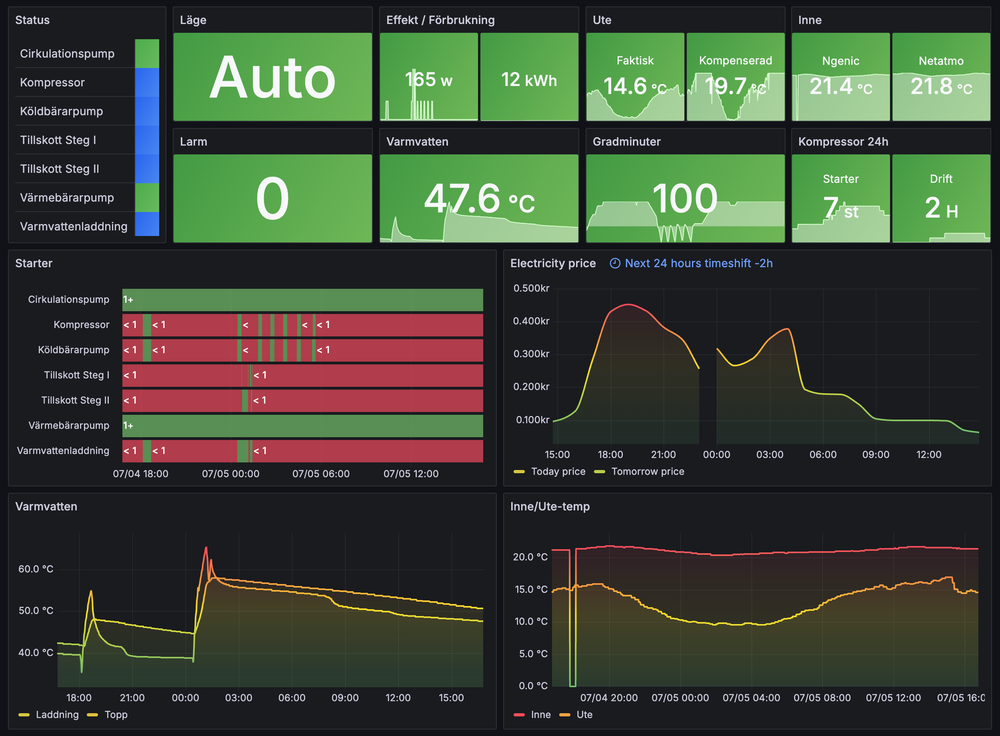

# Husdata Prometheus Exporter for Home Assistant

## Overview
Husdata Prometheus Exporter is a Home Assistant add-on that integrates with Husdata gateways(H60/H66). It polls and exports data from these Husdata gateways, presenting Husdata heat pump metrics in a format that is fully compatible with Prometheus, enhancing your ability to monitor and analyze your heat pump's performance effectively.

This add-on has been developed primarily for the Husdata H66 and Nibe ground source heat pumps equipped with the Styr2002 interface as well as the Bosch EHP AW pumps with the Rego800 interface. It offers mostly complete metrics coverage for these specific models, as supported by Husdata. While a lot of the metrics should work for other heat pumps as well the compatibility and functionality may vary.

## Features
- Periodic polling of data from Husdata gateways.
- Exports Husdata metrics in a prometheus format for easy integration and monitoring.
- Customizable polling intervals.
- Supports Swedish and English label values for sensors etc(see below).
- Supports Home Assistant Ingress and a toggleable external server for direct access.

## Installation

### Prerequisites
- A running Home Assistant installation with add-on support
- Heatpump with a Husdata H60 or H66 gateway connected and API enabled

### Steps
1. **Add Repository to Home Assistant:**
    

    Or manually:
   - Navigate to the Add-on Store in your Home Assistant UI: `Settings` -> `Add-ons` -> `Add-on Store`.
   - Click the 3-dots in the upper right corner, select `Repositories`, and paste in this URL: [https://github.com/Prankstr/hassio-husdata-exporter](https://github.com/prankstr/hassio-husdata-exporter)

2. **Install Husdata Exporter:**
   - Refresh the page
   - Find Husdata Exporter in the list of available add-ons, open it and click 'Install'.

## Configuration
Configure the add-on through the Home Assistant UI with the following options:
- `husdata_hostname` (required): Hostname or IP address of your Husdata gateway.
- `language` (optional): Language for metrics (options: "Swedish", "English"; default: "Swedish").
- `external_server` (optional): Enable/disable direct access to the add-on (default: false).
- `poll_interval` (optional): Time interval (in seconds) between data polls (default: 15).
- `log_level` (optional): Set the logging level (options: "Info", "Debug", "Warn", "Error"; default: "Info").

## Usage
Once the Husdata Exporter add-on is configured and running:
- The exporter will start polling data from your Husdata gateway immediately.
- For scraping within Home Assistant: Configure your monitoring tool to scrape metrics from `http://d5f5b367-husdata-exporter:8099/metrics`.
- For external scraping: Enable the external server in settings and configure your tool to scrape from `http://<your-server-ip-or-hostname>:9101/metrics`.

## Available Metrics

| Register  | Metric Name                                       | Label (Swedish)          | Label (English)          |
|-----------|---------------------------------------------------|--------------------------|--------------------------|
| `0001`    | `heatpump_sensor_temperature_celsius`             | Returledning             | Radiator Return          |
| `0004`    | `heatpump_sensor_temperature_celsius`             | Framledning              | Heat Carrier Forward     |
| `0005`    | `heatpump_sensor_temperature_celsius`             | Köldbärare In            | Brine In Condensor       |
| `0006`    | `heatpump_sensor_temperature_celsius`             | Köldbärare Ut            | Brine Out Evaporator     |
| `0007`    | `heatpump_sensor_temperature_celsius`             | Ute                      | Outdoor                  |
| `0008`    | `heatpump_sensor_temperature_celsius`             | Rum                      | Indoor                   |
| `0009`    | `heatpump_sensor_temperature_celsius`             | Varmvatten Topp          | Warm Water Top           |
| `000A`    | `heatpump_sensor_temperature_celsius`             | Varmvatten Mantel        | Warm Water Mid           |
| `000B`    | `heatpump_sensor_temperature_celsius`             | Hetgas                   | Hot Gas                  |
| `000C`    | `heatpump_sensor_temperature_celsius`             | Suggas                   | Suction Gas              |
| `000D`    | `heatpump_sensor_temperature_celsius`             | Vätskeledning            | Liquid Flow              |
| `000E`    | `heatpump_sensor_temperature_celsius`             | Luftintag                | Air Intake               |
| `0011`    | `heatpump_sensor_temperature_celsius`             | Pool                     | Pool                     |
| `0020`    | `heatpump_sensor_temperature_celsius`             | Framledning 2            | Radiator Forward 2       |
| `0022`    | `heatpump_sensor_temperature_celsius`             | Returledning 2           | Radiator Return 2        |
| `1A09`    | `heatpump_unit_on`                                | Fläkt                    | Fan                      |
| `1A0A`    | `heatpump_unit_on`                                | Högt tryck               | High Pressostat          |
| `1A0B`    | `heatpump_unit_on`                                | Lågt tryck               | Low Pressostat           |
| `4101`    | `heatpump_sensor_current_ampere`                  | Ström L1                 | Load L1                  |
| `4102`    | `heatpump_sensor_current_ampere`                  | Ström L2                 | Load L2                  |
| `4103`    | `heatpump_sensor_current_ampere`                  | Ström L3                 | Load L3                  |
| `BC61`    | `heatpump_unit_starts_total`                      | Kompressorstarter        | Compressor Starts        |
| `6C60`    | `heatpump_unit_runtime_seconds_total`             | Kompressortimmar         | Compressor Runtime       |
| `6C63`    | `heatpump_unit_runtime_seconds_total`             | Tillskottstimmar         | Aux Runtime              |
| `6C64`    | `heatpump_unit_runtime_seconds_total`             | Varmvattentimmar         | Warm Water Runtime       |
| `1A01`    | `heatpump_unit_on`                                | Kompressor               | Compressor               |
| `1A02`    | `heatpump_unit_on`                                | Tillskott Steg I         | Add Heat Step 1          |
| `1A03`    | `heatpump_unit_on`                                | Tillskott Steg II        | Add Heat Step 2          |
| `1A04`    | `heatpump_unit_on`                                | Värmebärarpump           | Pump Heat Circuit        |
| `1A05`    | `heatpump_unit_on`                                | Köldbärarpump            | Pump Cold Circuit        |
| `1A06`    | `heatpump_unit_on`                                | Cirkulationspump         | Pump Radiator            |
| `1A07`    | `heatpump_unit_on`                                | Varmvattenladdning       | Switch Valve 1           |
| `0212`    | `heatpump_settings_hot_water_start_temperature_celsius` | Varmvatten Start     | Hot Water Start Temp     |
| `0208`    | `heatpump_settings_hot_water_stop_temperature_celsius`  | Varmvatten Stop      | Hot Water Stop Temp      |
| `2204`    | `heatpump_settings_room_compensation`            | Rumskompensering         | Room Sensor Influence    |
| `0203`    | `heatpump_settings_room_temp`                    | Rumstemp                 | Room Temp Setpoint       |
| `2205`    | `heatpump_settings_curve_slope`                   | Kurvlutning              | Heat Set 1 CurveL        |
| `2222`    | `heatpump_settings_curve_slope`                   | Kurvlutning 2            | Heat Set 1 CurveL2       |
| `2207`    | `heatpump_settings_curve_offset`                  | Förskjutning värmekurva  | Heat Set 3 Parallel      |
| `2224`    | `heatpump_settings_curve_offset`                  | Förskjutning värmekurva 2| Heat Set 3 Parall2       |
| `8105`    | `heatpump_degree_minutes_celsius`                 | Gradminuter              | Degree Min Integral      |
| `0107`    | `heatpump_heating_set_point`                      | Börvärde                 | Heating Setpoint         |
| `2201`    | `heatpump_mode`                                   | Läge                     | Operating Mode           |
| `2A20`    | `heatpump_alarm`                                  | Alarm                    | Alarm                    |
| `22F2`    | `heatpump_alarm_reset`                            | Alarm Reset              | Alarm Reset              |
| `CFAA`    | `heatpump_sensor_power_watt`                      | Effekt                   | Power Consumption        |
| `1A0C`    | `heatpump_unit_on`                                | Värmekabel               | Heating Cable            |
| `1A0D`    | `heatpump_unit_on`                                | Vevhusvärmare            | Crank Case Heater        |
| `3104`    | `heatpump_sensor_add_heat_status`                 | Tillskottsstatus         | Add Heat Status          |
| `0217`    | `heatpump_settings_outdoor_temp_offset`           | Ute Temp Offset          | Outdoor Temp Offset      |

## Dashboard

I've included my `dashboard.json` for Grafana which is pre-configured in Swedish and can serve as a base for creating your custom dashboard to monitor your heatpump.

## License
This project is licensed under the [MIT License](LICENSE).